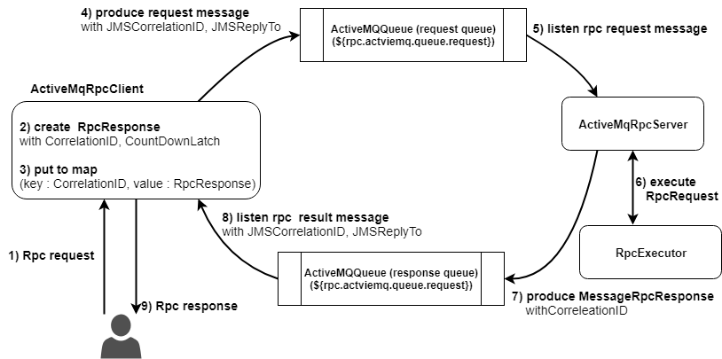

## Rpc server & client with multiple message queue(ActiveMQ, RabbitMQ, Kafka)  

this is a sample guide project for RPC pattern by using multiple message queue  

suppose RpcClient interface like below  

```aidl
public interface RpcClient {

    RpcResponse call(RpcRequest request);

    CompletableFuture<RpcResponse> callAsync(RpcRequest rpcRequest);
}
```  

RpcClient produce rpc request messages and wait for reply.

This project support multiple message queues such as AcitveMQ, RabbitMQ, Kafka depends on properties  

> application.yaml  

```aidl
# Rpc configs
rpc:
  # enable rpc server
  enabled: true 
  # rpc types ["activemq", "rabbitmq", "kafka"]
  type: activemq 
  ...
``` 

---  

> Getting started  

- **running spring boot**  

```aidl
$ git clone https://github.com/zacscoding/springboot-multiple-messages.git
$ cd springboot-multiple-messages
$ ./gradlew bootRun
```  

- **simple rpc request**  

```
// e.g ) springboot-multiple-messages/src/resource/request.sh [payload] [sleep]
$ springboot-multiple-messages/src/resource/request.sh message 5000
```  

---

> RpcRequest Queue, Reply Queue  

- ActiveMQ  

  

- RabbitMQ  

will added

- Kafka  

will added  

---  